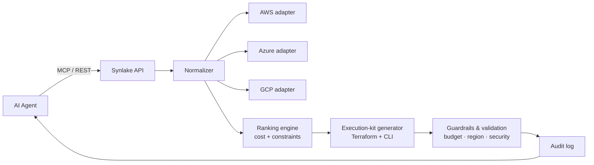

# Synlake — Cloud Infrastructure MCP for Autonomous Agents

> One API. Three clouds. Terraform + cost estimates in milliseconds.
> The data-infrastructure layer built for AI agents.


**Live product:** [synlake.ai](https://synlake.ai) · **Docs:** [quickstart](https://www.synlake.ai/docs/quickstart.html) · **API reference:** [api/docs](https://www.synlake.ai/api/docs)

---

This repository is a **public technical overview** of Synlake's cloud-infrastructure MCP server: the architecture, the agent-facing API contract, and example payloads. The production implementation (adapters, pricing engine, auth) is private — everything here is documentation and sanitized examples meant to show *how the system is designed*, not its internals.

## The problem

Cloud infrastructure was built for a human at a dashboard. Autonomous agents need something different:

- **Fragmented data** — AWS, Azure, and GCP each expose different schemas, pricing models, and APIs. Agents burn cycles writing adapters.
- **No machine-ready standard** — cloud docs are written for people. Without a normalized JSON contract, every integration is bespoke glue code.
- **No safe execution loop** — agents can plan but can't safely act. Without cost guardrails and validation, a human has to stay in the loop.

## What Synlake does

A single **MCP-compatible API** that lets an agent describe what it needs and get back the best option across every major cloud — normalized, costed, validated, and ready to deploy.

- **Normalize** — unified JSON schema across AWS, Azure, and GCP for compute, storage, and databases.
- **Execute** — auto-generated Terraform HCL and CLI commands, validated on demand. No glue code.
- **Validate** — budget caps, region policies, and security checks enforced *before* execution.
- **Audit** — every query logged with request, response, cost, and timestamp.

## Architecture



An agent sends an intent. Synlake normalizes options across clouds, ranks them by cost and constraints, generates a deploy-ready execution kit, runs guardrail checks, logs the call, and returns one machine-ready payload.

## Agent-facing contract

**Request** — describe the intent, not the implementation:

```json
{
  "intent": "compute",
  "service": "compute",
  "requirements": { "vcpus_min": 2, "memory_gb_min": 4 },
  "constraints": { "budget_monthly_max": 100, "providers": ["aws"] }
}
```

**Response** — best option + execution kit + guardrail results (≈187 ms):

```json
{
  "status": "success",
  "recommendation": {
    "provider": "aws",
    "instance": "t3.medium",
    "region": "us-east-1",
    "monthly_cost": 29.95,
    "execution_kit": {
      "terraform_hcl": "resource \"aws_instance\" ...",
      "cli_command": "aws ec2 run-instances ...",
      "validation": "passed"
    }
  },
  "alternatives": 4,
  "guardrails": "budget_ok | region_ok"
}
```

## Capabilities

### Multi-cloud normalization

One contract for every provider — always machine-ready, always current:

```json
{
  "service": "compute",
  "provider": "aws",
  "instance": "t3.medium",
  "specs": { "vcpus": 2, "memory_gb": 4, "network": "moderate" },
  "price_per_hour": 0.0416,
  "regions": ["us-east-1", "eu-west-1"]
}
```

### Financial guardrails

Constraints are validated before anything is returned as deployable:

```json
{
  "validation": "passed",
  "checks": {
    "budget": "$29.95 < $100 limit",
    "region": "us-east-1 allowed",
    "security": "no public access",
    "encryption": "EBS encrypted"
  },
  "spending_cap": { "monthly_limit": 100, "used": 29.95, "remaining": 70.05 }
}
```

### Full audit trail

Every call is logged for cost tracking and compliance:

```json
{
  "log_id": "req_8f2a4b6c",
  "timestamp": "2026-06-01T14:23:07Z",
  "agent": "agent-42",
  "endpoint": "/v1/infrastructure/query",
  "provider": "aws",
  "cost_estimate": 29.95,
  "response_ms": 187,
  "status": "success",
  "guardrails": "all_passed"
}
```

## Try it

```bash
curl -X POST https://api.synlake.ai/v1/infrastructure/query \
  -H "Content-Type: application/json" \
  -d '{"intent":"compute","service":"compute","requirements":{"vcpus_min":2,"memory_gb_min":4},"constraints":{"budget_monthly_max":100,"providers":["aws"]}}'
```

100 free API calls / month — no credit card required. Get a key at [synlake.ai](https://synlake.ai/#get-key).

## Why Synlake

| Approach            | Multi-cloud | Agent-ready JSON | Execution kit | Cost guardrails | Audit trail |
| ------------------- | ----------- | ---------------- | ------------- | --------------- | ----------- |
| DIY Terraform       | Manual      | No               | You write it  | No              | No          |
| Pulumi / Crossplane | Yes         | No               | Partial       | No              | Partial     |
| Cloud provider SDKs | Single      | Partial          | No            | No              | Partial     |
| Agent frameworks    | Via tools   | Partial          | No            | No              | No          |
| **Synlake**         | **3 clouds**| **100%**         | **Full kit**  | **Built-in**    | **Every call** |

## Tech stack

TypeScript · Node.js · Model Context Protocol (MCP) · AWS / Azure / GCP pricing + provisioning APIs · Terraform HCL generation.

## Status

Live on the **MCP Registry** and **Smithery**. 3 cloud providers normalized · 5 regions live · 66 instance types · ~200 ms average response · deterministic output.

## About

Built by [**Synlake LLC**](https://synlake.ai) — data infrastructure for the autonomous economy.

Contact: hello@synlake.ai · [LinkedIn](https://www.linkedin.com/company/synlake) · [X](https://x.com/synlake_ai)

> This repo is documentation only and contains no proprietary source or credentials.
